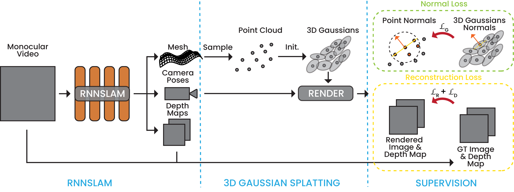

# Gaussian Pancakes 🥞
| [Project Page](https://smbonilla.github.io/GaussianPancakes/) | [Paper](https://arxiv.org/abs/2404.06128)  | |
|:--------------------------------------------------:|:--------------------------------------------------:|:--------------------------------------------:|


> [Gaussian Pancakes: Geometrically-Regularized 3D Gaussian Splatting for Realistic Endoscopic Reconstruction](https://arxiv.org/abs/2404.06128)  
> [Sierra Bonilla](https://sierrabonilla.com/), [Shuai Zhang](https://scholar.google.co.uk/citations?user=F2Q8SKIAAAAJ&hl=e), [Dimitrios Psychogyios](https://orcid.org/0000-0002-3377-530X), [Danail Stoyanov](https://scholar.google.co.uk/citations?user=pGfEK6UAAAAJ&hl=en), [Francisco Vasconcelos](https://scholar.google.co.uk/citations?user=hCMO0ycAAAAJ&hl=en), [Sophia Bano](https://sophiabano.github.io/)

<p align="center">
  
</p>

## Overview

This software implements the regularized splatting process presented in our paper [Gaussian Pancakes](https://arxiv.org/abs/2404.06128) to be presented at MICCAI'24. 

For the efficient differential Gaussian normal calculation submodule: https://github.com/smbonilla/gaussian-norms


### Pipeline
<!-- 
 -->

<picture>
  <source media="(prefers-color-scheme: dark)" srcset="images/Method_darkmode.png">
  <source media="(prefers-color-scheme: light)" srcset="images/Method_lightmode.png">
  
</picture>

### Cloning

To get started, clone the repository:

```bash
git clone https://github.com/smbonilla/GaussianPancakes.git
cd GaussianPancakes
```
### Environment Setup 

This repository includes an `environment.yml` file with pinned versions of packages. However, please note that this environment is very specific to our setup, and adjustments may be necessary depending on your CUDA version, GPU, or other hardware configurations.:

```bash
conda env create --file environment.yml
conda activate gs_gnorms
```

### Note on Environment Setup

The environment.yml file includes tightly pinned versions of key dependencies. However, please note that certain packages may require adjustments depending on your specific CUDA version and GPU setup. You may need to experiment with different package versions to find the right combination for your system.

For users on different hardware setups, it's possible to create a base environment using the original Gaussian Splatting repository: [Gaussian Splatting Repo](https://github.com/graphdeco-inria/gaussian-splatting) and then manually install additional dependencies like FAISS, FFmpeg, NumPy, PickleShare, Pillow, PyTorch-MSSSIM, TensorBoard, LPIPS, and the custom gaussian-norms submodule.

### Hardware and Software Requirements (similar to 3D GS)
- **CUDA-ready GPU** with Compute Capability 7.0+ 
- **Minimum 24 GB VRAM** 
- **C++ Compiler** for PyTorch extensions 
- **CUDA SDK 11.3 or higher** (ensure compatibility with the GPU and PyTorch version)
  - We used **CUDA 11.3**, but other versions may work with adjustments.
- Ensure your **C++ Compiler and CUDA SDK** are compatible with each other and PyTorch (the custom gaussian norms package may not build if they are not).

### Initialization

Please note that we **cannot provide access to the RNNSLAM codebase**, as it is private and not part of this repository. This codebase assumes a similar dataset initialization to COLMAP, but with an additional folder for depth maps (`depths`) and a slightly different camera pose format. 

The expected file format for the dataset is:

```
dataset_root/
│
├── depths/               # Directory containing depth maps (e.g., .png files)
│
├── images/               # Directory containing image frames
│
├── camera_poses.txt      # TUM format pose file:
│                         # timestamp tx ty tz qx qy qz qw
│
├── cameras.txt           # Camera information with the format:
│                         # CAMERA_ID, MODEL, WIDTH, HEIGHT, PARAMS[]
│
└── points3D.ply          # 3D points in PLY format
```

While we cannot release the RNNSLAM code, the dataset setup follows a similar structure to COLMAP with minor adjustments.

### Running 

```python
python train.py -s <path to RNNSLAM Dataset>
```

Refer to the Gaussian Splatting Repo for command line arguments detailed, we only added a few arguments regarding weights on normal calculation, when to start normal calculation, and if skipping normal calculation. otherwise refer to command line detailed: https://github.com/graphdeco-inria/gaussian-splatting 

### Evaluation

All experiments with arguments and evaluation were run using `evaluate.py`.

## Acknowledgments

* Please cite the original [3D Gaussian Splatting paper](https://arxiv.org/abs/2308.04079) by Kerbl et al. 
```bibtex
@Article{kerbl3Dgaussians,
      author       = {Kerbl, Bernhard and Kopanas, Georgios and Leimk{\"u}hler, Thomas and Drettakis, George},
      title        = {3D Gaussian Splatting for Real-Time Radiance Field Rendering},
      journal      = {ACM Transactions on Graphics},
      number       = {4},
      volume       = {42},
      month        = {July},
      year         = {2023},
      url          = {https://repo-sam.inria.fr/fungraph/3d-gaussian-splatting/}
}
```
* If you find this helpful in your research, please also consider citing the [Gaussian Pancakes](https://arxiv.org/abs/2404.06128) paper 🙌
```bibtex
@article{Bonilla2024ARXIV,
  author    = {Sierra Bonilla and Shuai Zhang and Dimitrios Psychogyios and Danail Stoyanov and Francisco Vasconcelos and Sophia Bano},
  title     = {Gaussian Pancakes: Geometrically-Regularized 3D Gaussian Splatting for Realistic Endoscopic Reconstruction},
  journal   = {arXiv},
  volume    = {2404.06128},
  year      = {2024},
}
```
* Thanks to authors of this repo as well: [depth-diff-gaussian-rasterization](https://github.com/ingra14m/depth-diff-gaussian-rasterization/tree/depth) (use the `depth` branch for depth gradients)


## Update History
* **21/03/2024** - Code: initial code: coming soon
* **16/08/2024** - Code: initial code release
* **16/08/2024** - Code: `gaussian-norms` submodule will be released as its own repo at a later date
* **16/08/2024** - Code: `gaussian-norms` repo released: [https://github.com/smbonilla/gaussian-norms](https://github.com/smbonilla/gaussian-norms)
* **24/09/2024** - Code: adaptations made to integrate with 3D Gaussian Splatting
* **08/10/2024** - Paper: paper presentation at MICCAI: Tuesday, October 8, 2024, 10:30AM - 11:30AM (Times in Morocco)

## To-Do
* **24/09/2024** - Code: testing environment setup on different GPU configurations
* **24/09/2024** - Code: add example of dataset to repo & jupyter notebook example usage 